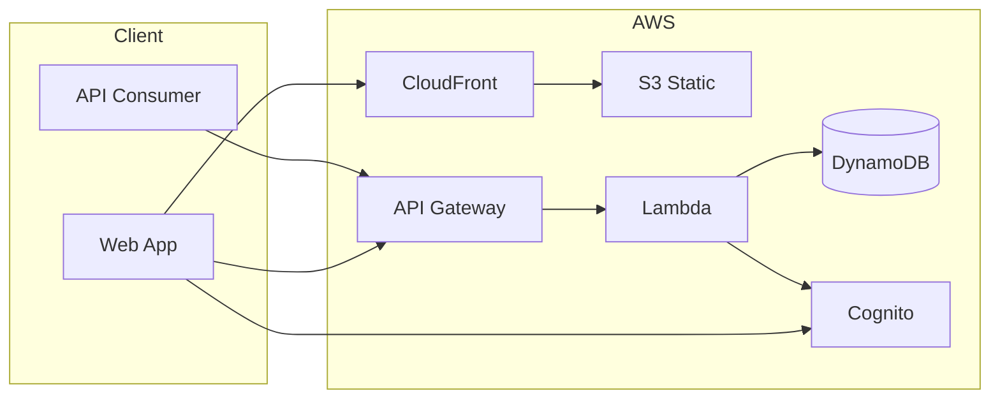

# Architecture

This document defines the chosen stack and high-level architecture for the Loyalty Management Platform. All implementation and agent tasks align to these decisions.

## Stack (locked)

| Layer | Choice | Rationale |
|-------|--------|-----------|
| **Backend** | Python FastAPI (AWS Lambda via Mangum) + API Gateway (HTTP API) | Single backend serves /api/v1; serverless, pay-per-request; CDK-managed. |
| **Database** | Amazon DynamoDB | Serverless, tenant partition keys; single-table design for cost and scale. |
| **Auth** | Amazon Cognito | User pools for Program Admin and End-user; JWT for API auth. |
| **Payments** | Razorpay (India) | Subscriptions for platform billing; optional Payments for merchant-facing charges later. |
| **Frontend** | React (Vite) on S3 + CloudFront | Static hosting; low cost; CDK for S3 bucket and distribution. |
| **Infrastructure** | AWS CDK (TypeScript) | Single repo; `packages/infra`; all resources defined as code. |

**Out of scope for MVP:** AppSync (GraphQL), RDS/Aurora, serverless Next.js. These can be revisited in a later phase.

## High-level architecture



- **Web:** Users access the React app via CloudFront (HTTPS); static assets from S3.
- **API:** All loyalty and billing APIs use **versioned base path** `/api/v1/` from day 1 (e.g. `/api/v1/programs`, `/api/v1/transactions`). API Gateway HTTP API routes to Lambda; Cognito authorizer for protected routes. See [DECISIONS.md](DECISIONS.md).
- **Data:** Lambda reads/writes DynamoDB with **tenant-scoped partition keys on every path**; no query spans tenants. Tenant ID comes from JWT or API key; never trust client-supplied tenant_id for authorization.

For the full set of diagrams (flows, AWS infrastructure, data model, deployment), see [ARCHITECTURE_DIAGRAMS.md](ARCHITECTURE_DIAGRAMS.md).

## API versioning and tenant scope

- **Versioning:** All APIs are under `/api/v1/`. This allows future v2 without breaking early integrations.
- **Tenant scope:** Every API handler must resolve tenant from auth (Cognito JWT or API key) and use it in DynamoDB partition key (or GSI). Backend must be ready for tenant-scoped API key auth even if the API keys UI is delivered in a later phase.

## DynamoDB: key design and future readiness

- **Single-table design** with clear PK/SK patterns (e.g. `TENANT#<id>`, `PROGRAM#<tenant>#<id>`, `MEMBER#<program>#<id>`). All access patterns and key design are in [docs/DYNAMODB_KEYS.md](DYNAMODB_KEYS.md); see also [ARCHITECTURE_DIAGRAMS.md](ARCHITECTURE_DIAGRAMS.md) (data model).
- **Future-ready for analytics:** Design keys and GSIs so that reporting, cohort-style queries, and analytics (Phase 3) can be supported without schema migration. Avoid changing key design after production data exists.

## Razorpay: environments and secrets

- **Dev/staging:** Razorpay **test mode** and test credentials. Store in env or SSM Parameter Store.
- **Prod:** Razorpay **live** only. Document in a short runbook how to configure keys (env vars or SSM) so new devs and CI can run without production keys. See [DECISIONS.md](DECISIONS.md).

## Observability and webhooks

- **Lambda logs:** All Lambda logs go to CloudWatch. Ensure log level and structure allow debugging in production.
- **Razorpay webhook failures:** On webhook handler non-200 or exception, log clearly (e.g. event_id, error). Optional: dead-letter or CloudWatch alarm on "webhook failed" so we can retry or fix.

## CI and quality

- **Full CI:** Lint, unit tests, and functional (or integration) tests for every feature; `cdk synth` (and deploy for target env). Goal: **zero production bugs**. No feature merge without tests. See [DECISIONS.md](DECISIONS.md).

## Operations: prod safety

- **DynamoDB:** Enable **point-in-time recovery (PITR)** in production at go-live.
- **Rollback:** CDK/CloudFormation is source of truth. Tag or document "last known good" deploy so we can roll back if a release breaks production.

## Payments and billing (Razorpay)

- **Razorpay** is an external service. Lambda (or a dedicated billing module) calls Razorpay APIs to create Plans, create Subscriptions, and manage subscription state. No card data is stored in our system; Razorpay is PCI-compliant.
- **Webhook endpoint:** API Gateway (HTTP API) + Lambda exposes a public webhook URL for Razorpay. Razorpay sends subscription and (optionally) payment events to this URL. The handler **verifies the webhook signature** (using Razorpay webhook secret) before updating state. Use ports 80/443; whitelist Razorpay webhook IPs if required by security groups.
- **Tenant plan and billing status:** Stored in DynamoDB (e.g. on the tenant record or a dedicated `tenant_billing` entity). Fields: `plan_id`, `razorpay_subscription_id`, `billing_status` (active / past_due / cancelled / trialing), `current_period_end`. Used for access control (program/member limits, feature flags) and for the billing UI in the dashboard.

## Localization (India-first)

- **Frontend:** Use an i18n library (e.g. react-i18next or FormatJS) with message bundles per locale (`en-IN`, `hi-IN`). Default locale: India (INR, Asia/Kolkata). Support Devanagari script for Hindi.
- **Tenant/user preference:** Store the tenant’s (or user’s) display language preference in the backend; API and UI accept `Accept-Language` or an explicit locale and return/render content accordingly. Amounts are stored in smallest unit (e.g. paise) with currency code; Razorpay amounts in INR.

## Repo layout

```
packages/
  backend/      # Python FastAPI API (Lambda via Mangum); serves /api/v1
  api/          # (Legacy) Node.js Lambda — replaced by backend for /api/v1
  web/          # React (Vite) frontend
  infra/        # CDK stacks (API Gateway, Lambda, DynamoDB, Cognito, S3, CloudFront)
docs/           # PRD, ARCHITECTURE, AGENT_RUNBOOK, openapi.yaml
```

CDK in `packages/infra` references the `backend` (Python Lambda container) and `web` packages for deployment. OpenAPI spec is exported to `docs/openapi.yaml` for MCP and CodePlugins.

## Cost

- **Serverless default:** Lambda, API Gateway, DynamoDB (on-demand), S3, and CloudFront are pay-per-use; no idle EC2 cost.
- **DynamoDB:** Use on-demand capacity unless load is predictable; minimize GSIs to control cost.
- **Lambda:** Right-size memory and timeout; avoid long-running or runaway concurrency.
- **Data transfer:** Keep API and frontend in the same region; use CloudFront caching to reduce origin requests.
- **Cognito:** Free tier is generous; monitor MAU if End-user base grows.
- **Governance:** All CDK resources are tagged (e.g. `Project=LoyaltyPlatform`, `Environment=dev|staging|prod`). Set a **billing alert** in AWS Budgets (e.g. $50 or $100) for the project account.

Cost assumptions and monitoring steps are updated in this section as the project evolves.
