# Architecture and Flow Diagrams

This document contains all architecture and flow diagrams for the Loyalty Management Platform. Diagrams are in Mermaid so they stay version-controlled and render in GitLab, GitHub, and most doc tools. For pixel-perfect AWS-style diagrams with official icons, you can recreate the infrastructure view in draw.io using [AWS Architecture Icons](https://aws.amazon.com/architecture/icons/); this file remains the source of truth for structure and flows.

## Table of contents

- [Overall architecture](#1-overall-architecture)
- [AWS infrastructure](#2-aws-infrastructure)
- [Flow: Tenant onboarding and sign-up](#31-tenant-onboarding-and-sign-up)
- [Flow: Program creation and rules](#32-program-creation-and-rules)
- [Flow: Earn transaction](#33-earn-transaction-flow)
- [Flow: Burn and redemption](#34-burn--redemption-flow)
- [Flow: Balance and history view](#35-balance-and-history-view)
- [Flow: Subscription billing](#36-subscription-billing-flow)
- [Flow: Razorpay webhook](#37-razorpay-webhook-flow)
- [Flow: API consumer](#38-api-consumer-flow)
- [Flow: Merchant payment (Phase 2)](#39-merchant-payment-flow-phase-2)
- [Data model](#41-data-model)
- [Multi-tenant isolation](#42-multi-tenant-isolation)
- [Deployment pipeline](#43-deployment-pipeline)

---

## 1. Overall architecture

One-page view of the entire system: actors, front doors, auth, compute, data, and external services.

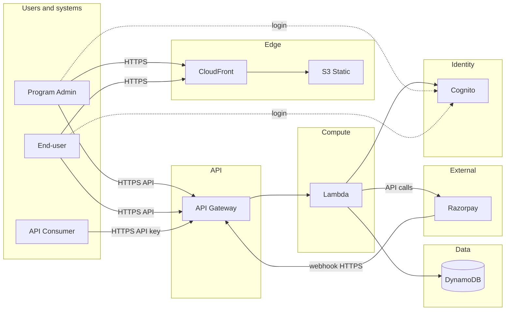

- **Actors:** Program Admin and End-user use the web app (CloudFront + S3); API consumer calls the API with a tenant-scoped API key.
- **Auth:** Cognito for login and JWT; API keys for programmatic access. Lambda uses tenant_id from JWT or API key for all data access.
- **Data:** DynamoDB holds tenants, programs, members, transactions, rewards, and billing state; all partitioned by tenant.
- **Razorpay:** Lambda calls Razorpay for subscriptions and (Phase 2) payments; Razorpay sends webhooks to our API Gateway.

---

## 2. AWS infrastructure

AWS services and how they connect. Grouped by Edge, API, Compute, Data, and Identity; Razorpay is external.

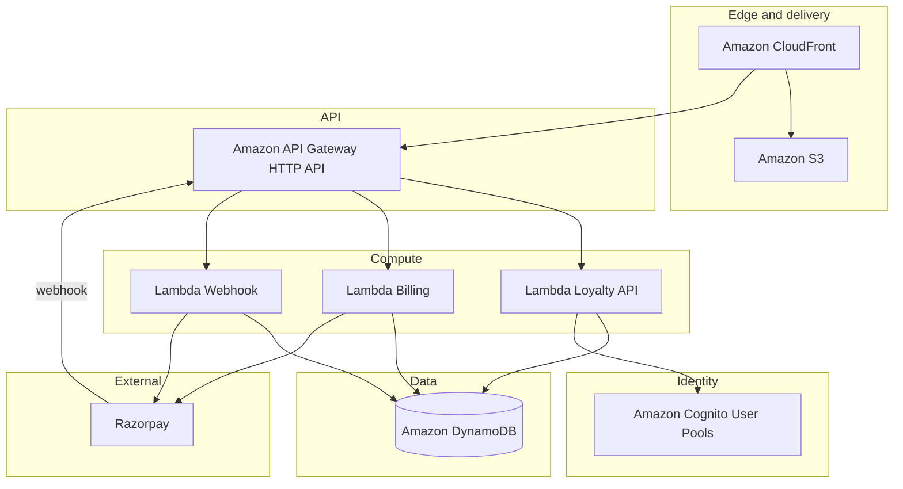

**AWS services used:** CloudFront, S3, API Gateway (HTTP API), Lambda, DynamoDB, Cognito. Optional: Secrets Manager or SSM Parameter Store for Razorpay API keys; IAM roles for Lambda execution.

---

## 3. Flow diagrams

### 3.1 Tenant onboarding and sign-up

Program Admin signs up via Cognito; optional tenant record is created via API and stored in DynamoDB; user is redirected to the dashboard.

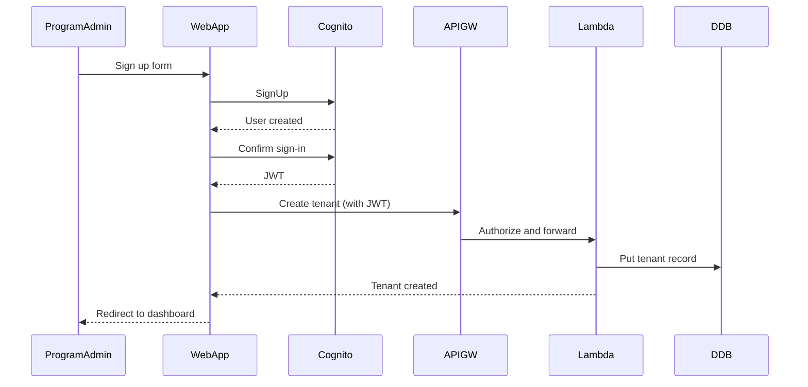

---

### 3.2 Program creation and rules

Program Admin creates a program and defines earn/burn rules and tiers via the dashboard; WebApp calls API, Lambda persists to DynamoDB.

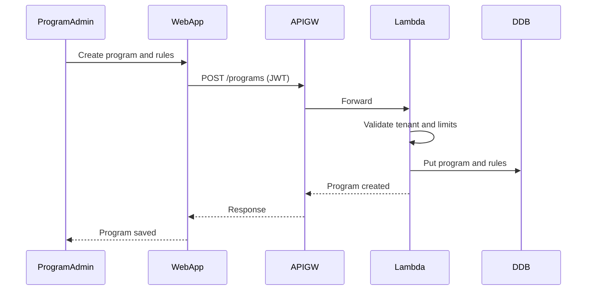

---

### 3.3 Earn transaction flow

API consumer or WebApp posts an earn event (e.g. purchase). Lambda validates, applies rules, updates balance in DynamoDB, and returns the new balance. Idempotency key supported when required.

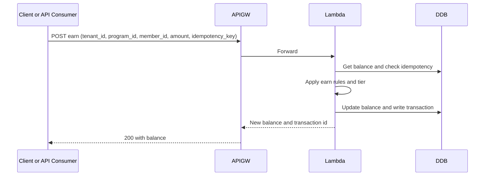

---

### 3.4 Burn and redemption flow

End-user or API redeems a reward. Lambda validates the reward, checks balance, deducts points, records redemption in DynamoDB, and returns success or failure.

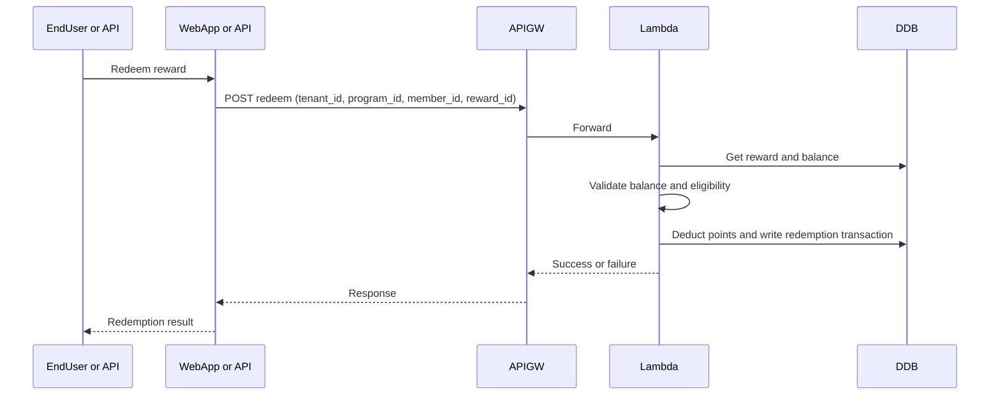

---

### 3.5 Balance and history view

End-user or Admin requests balance or transaction history. Lambda queries DynamoDB by tenant, program, and member and returns balance and list of transactions.

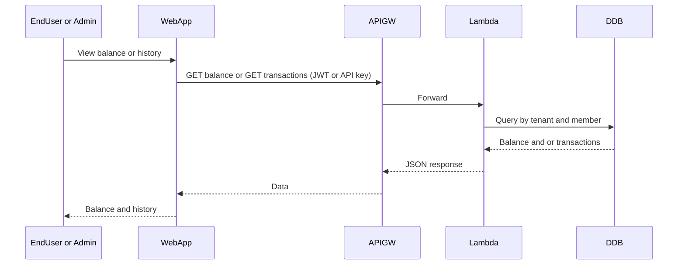

---

### 3.6 Subscription billing flow

Program Admin selects a plan (Starter/Growth/Scale). WebApp calls Lambda, which creates a Razorpay subscription or checkout URL; user is redirected to Razorpay Checkout. After payment, redirect back; webhook or callback updates tenant record in DynamoDB.

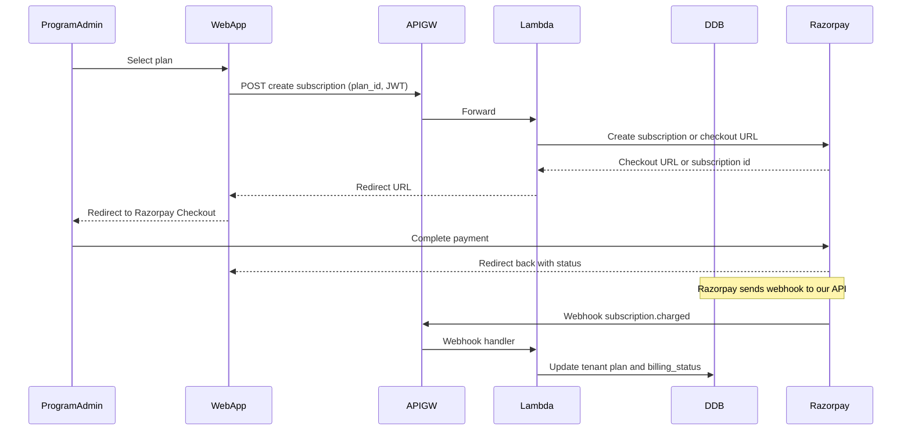

---

### 3.7 Razorpay webhook flow

Razorpay sends a POST to our webhook URL. Lambda verifies the signature, parses the event (e.g. subscription.charged, subscription.cancelled), and updates tenant billing state in DynamoDB. Idempotency by event_id is recommended.

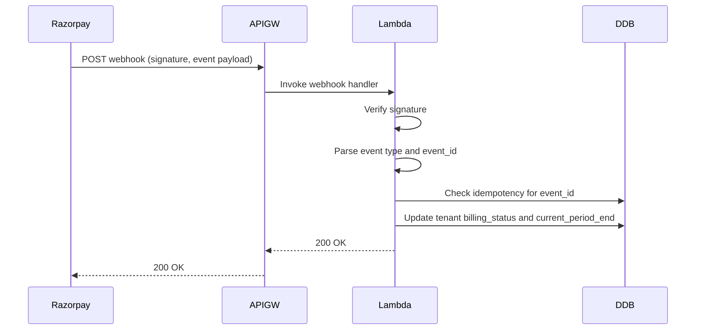

---

### 3.8 API consumer flow

External system (POS, e-commerce) uses a tenant-scoped API key. Request hits API Gateway; Lambda authorizes via API key and performs the same earn/burn logic as web flows; response includes balance or error.

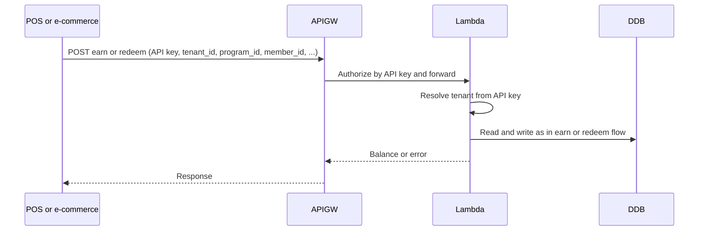

---

### 3.9 Merchant payment flow (Phase 2)

Optional: tenant initiates a charge to an end-user (e.g. paid reward). WebApp calls Lambda, which creates a Razorpay order or payment link; end-user pays on Razorpay; payment.captured webhook triggers Lambda to record payment and fulfill the reward in DynamoDB.

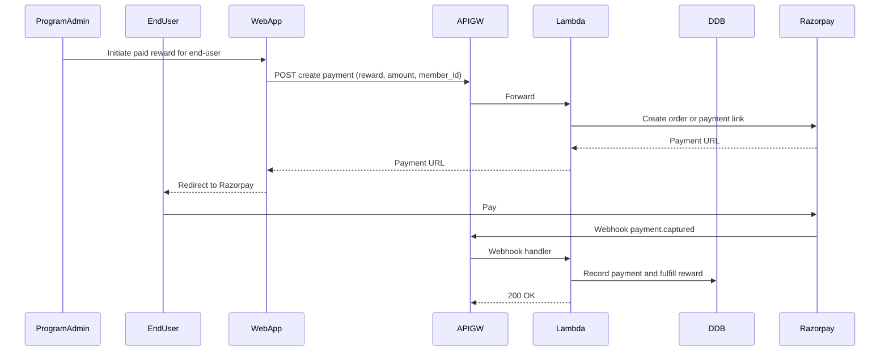

*Phase 2 feature.*

---

## 4. Supporting diagrams

### 4.1 Data model

Core entities and relationships. Tenant has many Programs; Program has many Members and many Rewards; Balance is per Member per Program; Transactions (earn/burn/redemption) reference Member, Program, and optionally Reward.

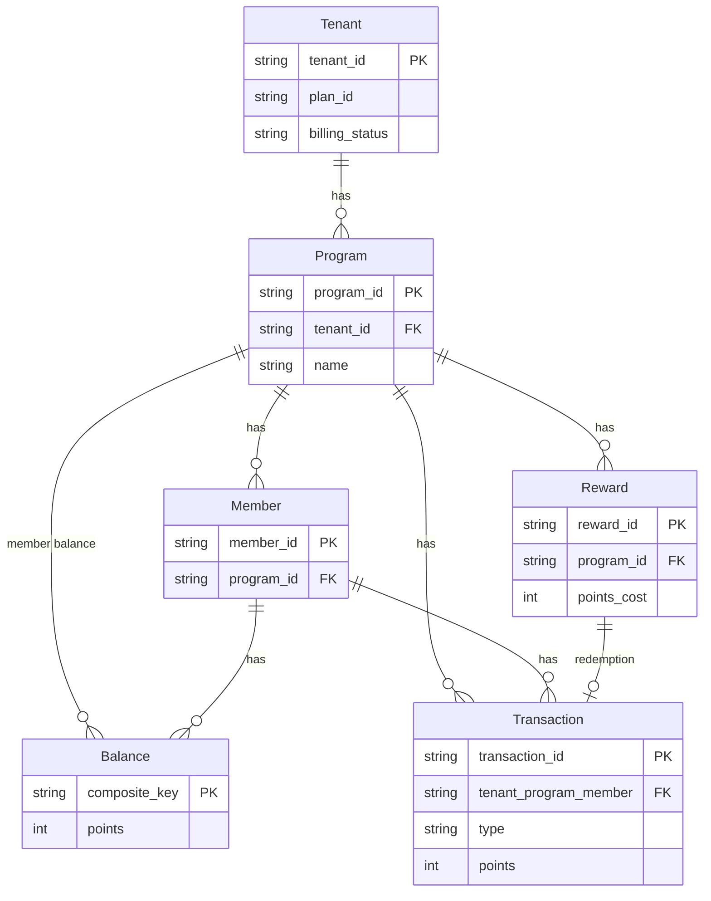

**DynamoDB key strategy (single-table option):** Partition key often includes `tenant_id` (e.g. `TENANT#<id>` or `PROGRAM#<tenant>#<id>`); sort key distinguishes entity type and scope (e.g. `PROGRAM#<id>`, `MEMBER#<id>`, `BALANCE#<member>`, `TXN#<id>`). All queries are scoped by tenant so no request spans multiple tenants.

---

### 4.2 Multi-tenant isolation

Every API request carries tenant_id (from JWT or API key). Lambda uses tenant_id in DynamoDB partition key and never queries across tenants.

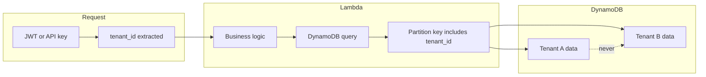

- **Tenant A** and **Tenant B** data are stored with different partition key values; no single query returns both.
- **Authorization:** API Gateway (Cognito authorizer or API key) ensures tenant_id is set from the authenticated identity; Lambda does not trust client-supplied tenant_id for cross-tenant access.

---

### 4.3 Deployment pipeline

Code is pushed to GitLab; CI runs lint, tests, and CDK synth; deploy (manual or automated) runs cdk deploy to update AWS (CloudFormation). Optional branches for dev, staging, prod.

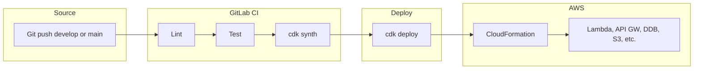

- **Pipeline:** Single pipeline (e.g. on merge to `develop` for dev, `main` for prod); optional manual approval or environment-specific deploy jobs.
- **CDK:** `packages/infra`; `cdk deploy` updates or creates the stack (Lambda, API Gateway, DynamoDB, Cognito, S3, CloudFront, webhook route).

---

## 5. Reference

- **Stack and rationale:** [ARCHITECTURE.md](ARCHITECTURE.md)
- **Product scope and flows:** [PRD.md](PRD.md)
- **Tasks and phases:** [TASKS.md](../TASKS.md)
